# 文字版式画廊

一个面向设计学习者、内容创作者和平面设计师的中文文字版式参考网站。首版收录 72 种值得单独学习的文字组织方法，按 8 个一级分类浏览。每种版式提供自解释样图、结构说明、适合场景、不适合场景和同类版式。

在线浏览：[type.chenlinplay.top](https://type.chenlinplay.top)


<!-- layout-gallery:start -->
## 72 种版式

点击任意预览图可打开仓库中的 1086 × 1448 高清源 PNG。

### A 编辑与信息组织 · 10 种

组织长文、目录、数据、时间与层级信息。

|  |  |  |  |
|---|---|---|---|
| [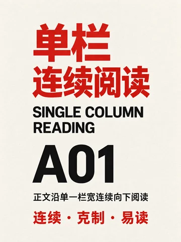](public/images/layouts/A01-单栏连续阅读.png)<br>**A01** 单栏连续阅读 | [](public/images/layouts/A02-对称中轴.png)<br>**A02** 对称中轴 | [](public/images/layouts/A03-非对称轴线.png)<br>**A03** 非对称轴线 | [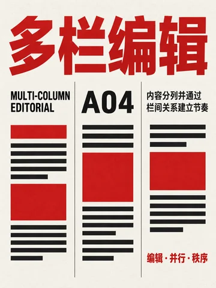](public/images/layouts/A04-多栏编辑.png)<br>**A04** 多栏编辑 |
| [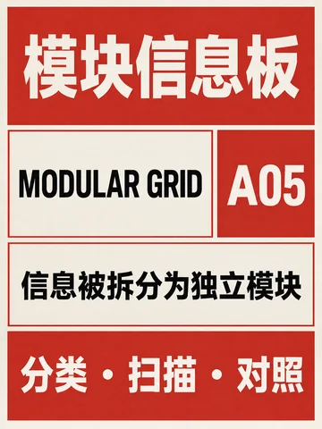](public/images/layouts/A05-模块信息板.png)<br>**A05** 模块信息板 | [](public/images/layouts/A06-主次层级网格-v2.png)<br>**A06** 主次层级网格 | [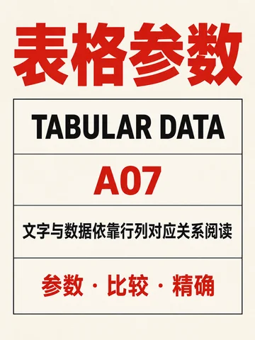](public/images/layouts/A07-表格参数-v2.png)<br>**A07** 表格参数 | [](public/images/layouts/A08-编号目录.png)<br>**A08** 编号目录 |
| [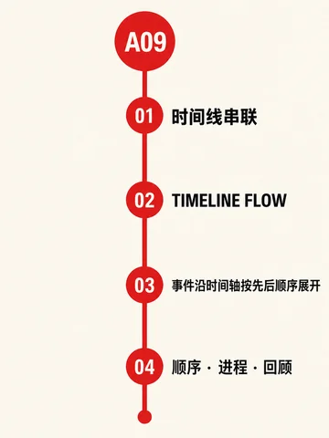](public/images/layouts/A09-时间线串联-v2.png)<br>**A09** 时间线串联 | [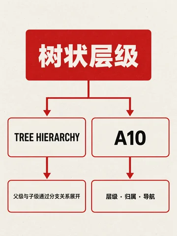](public/images/layouts/A10-树状层级.png)<br>**A10** 树状层级 |  |  |

### B 整页空间构图 · 10 种

决定文字在整张画布中的分区、围合与重心。

|  |  |  |  |
|---|---|---|---|
| [](public/images/layouts/B01-上下分区.png)<br>**B01** 上下分区 | [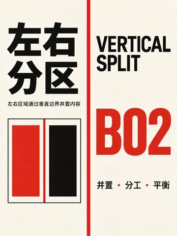](public/images/layouts/B02-左右分区.png)<br>**B02** 左右分区 | [](public/images/layouts/B03-对角分区.png)<br>**B03** 对角分区 | [](public/images/layouts/B04-四角围合.png)<br>**B04** 四角围合 |
| [](public/images/layouts/B05-边框围合.png)<br>**B05** 边框围合 | [](public/images/layouts/B06-偏置留白.png)<br>**B06** 偏置留白 | [](public/images/layouts/B07-中心聚合.png)<br>**B07** 中心聚合 | [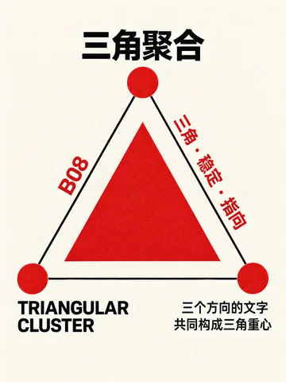](public/images/layouts/B08-三角聚合.png)<br>**B08** 三角聚合 |
| [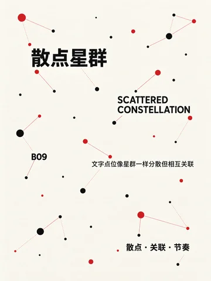](public/images/layouts/B09-散点星群.png)<br>**B09** 散点星群 | [](public/images/layouts/B10-嵌套框中框.png)<br>**B10** 嵌套框中框 |  |  |

### C 标题与尺度组织 · 8 种

用标题尺度、裁切、错位和跨栏建立视觉主次。

|  |  |  |  |
|---|---|---|---|
| [](public/images/layouts/C01-等宽堆叠.png)<br>**C01** 等宽堆叠 | [](public/images/layouts/C02-大小混排.png)<br>**C02** 大小混排 | [](public/images/layouts/C03-单字巨型.png)<br>**C03** 单字巨型 | [](public/images/layouts/C04-满版裁切.png)<br>**C04** 满版裁切 |
| [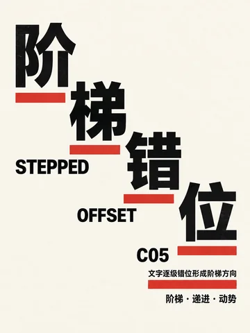](public/images/layouts/C05-阶梯错位.png)<br>**C05** 阶梯错位 | [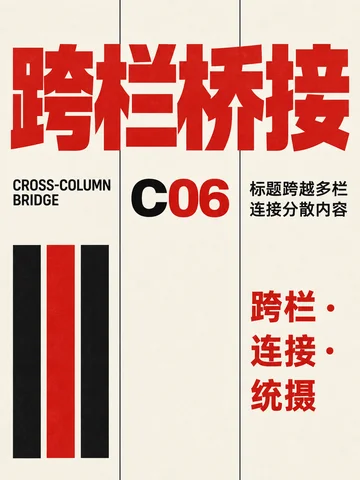](public/images/layouts/C06-跨栏桥接.png)<br>**C06** 跨栏桥接 | [](public/images/layouts/C07-字间嵌套.png)<br>**C07** 字间嵌套 | [](public/images/layouts/C08-字腔嵌文.png)<br>**C08** 字腔嵌文 |

### D 路径与流动 · 10 种

让文字沿直线、曲线、圆环或自由路径形成动势。

|  |  |  |  |
|---|---|---|---|
| [](public/images/layouts/D01-对角字带.png)<br>**D01** 对角字带 | [](public/images/layouts/D02-折线路径.png)<br>**D02** 折线路径 | [](public/images/layouts/D03-弧线标题.png)<br>**D03** 弧线标题 | [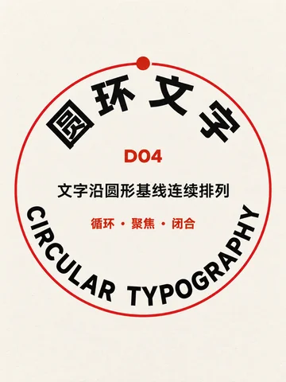](public/images/layouts/D04-圆环文字.png)<br>**D04** 圆环文字 |
| [](public/images/layouts/D05-同心圆层叠.png)<br>**D05** 同心圆层叠 | [](public/images/layouts/D06-螺旋文字.png)<br>**D06** 螺旋文字 | [](public/images/layouts/D07-波浪字带.png)<br>**D07** 波浪字带 | [](public/images/layouts/D08-放射文字.png)<br>**D08** 放射文字 |
| [](public/images/layouts/D09-自由轮廓路径.png)<br>**D09** 自由轮廓路径 | [](public/images/layouts/D10-流动层带.png)<br>**D10** 流动层带 |  |  |

### E 重复与节奏 · 8 种

通过重复、阵列、渐变与突变建立视觉节奏。

|  |  |  |  |
|---|---|---|---|
| [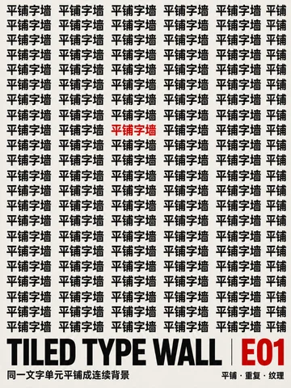](public/images/layouts/E01-平铺字墙.png)<br>**E01** 平铺字墙 | [](public/images/layouts/E02-错列字阵.png)<br>**E02** 错列字阵 | [](public/images/layouts/E03-尺度递变阵列.png)<br>**E03** 尺度递变阵列 | [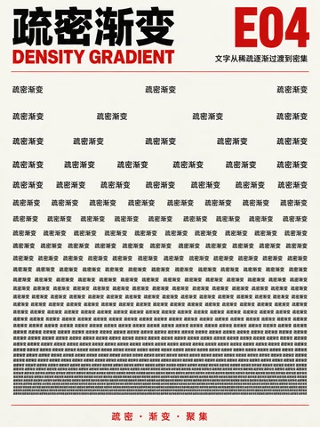](public/images/layouts/E04-疏密渐变.png)<br>**E04** 疏密渐变 |
| [](public/images/layouts/E05-重复中的突变.png)<br>**E05** 重复中的突变 | [](public/images/layouts/E06-旋转阵列.png)<br>**E06** 旋转阵列 | [](public/images/layouts/E07-镜像对读.png)<br>**E07** 镜像对读 | [](public/images/layouts/E08-回声位移.png)<br>**E08** 回声位移 |

### F 字图关系 · 8 种

处理文字与图形、主体、轮廓和负形之间的关系。

|  |  |  |  |
|---|---|---|---|
| [](public/images/layouts/F01-图文交替叙事.png)<br>**F01** 图文交替叙事 | [](public/images/layouts/F02-轮廓绕排-v2.png)<br>**F02** 轮廓绕排 | [](public/images/layouts/F03-负形嵌文-v2.png)<br>**F03** 负形嵌文 | [](public/images/layouts/F04-主体穿插标题.png)<br>**F04** 主体穿插标题 |
| [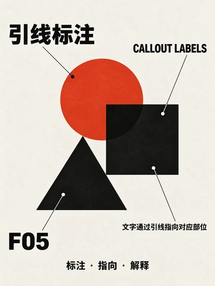](public/images/layouts/F05-引线标注.png)<br>**F05** 引线标注 | [](public/images/layouts/F06-文字图像窗口.png)<br>**F06** 文字图像窗口 | [](public/images/layouts/F07-文字拼成图像.png)<br>**F07** 文字拼成图像 | [](public/images/layouts/F08-图文棋盘.png)<br>**F08** 图文棋盘 |

### G 中文与多语编排 · 8 种

处理中文竖排、传统格式以及中外文并置。

|  |  |  |  |
|---|---|---|---|
| [](public/images/layouts/G01-传统竖排.png)<br>**G01** 传统竖排 | [](public/images/layouts/G02-横竖双轴.png)<br>**G02** 横竖双轴 | [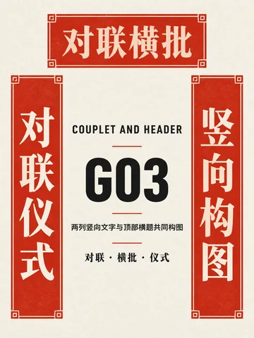](public/images/layouts/G03-对联横批.png)<br>**G03** 对联横批 | [](public/images/layouts/G04-题签落款.png)<br>**G04** 题签落款 |
| [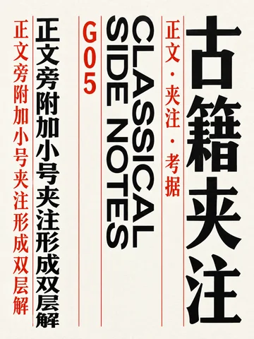](public/images/layouts/G05-古籍夹注.png)<br>**G05** 古籍夹注 | [](public/images/layouts/G06-诗词错落.png)<br>**G06** 诗词错落 | [](public/images/layouts/G07-汉字方阵.png)<br>**G07** 汉字方阵 | [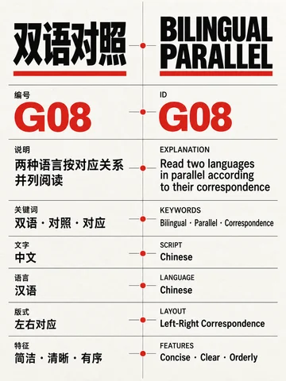](public/images/layouts/G08-双语对照.png)<br>**G08** 双语对照 |

### H 实验与空间编排 · 10 种

探索拼贴、解构、多轴、透视和空间错视。

|  |  |  |  |
|---|---|---|---|
| [](public/images/layouts/H01-文字拼贴.png)<br>**H01** 文字拼贴 | [](public/images/layouts/H02-切片错位-v2.png)<br>**H02** 切片错位 | [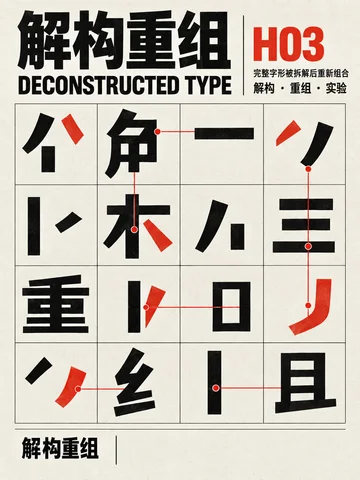](public/images/layouts/H03-解构重组.png)<br>**H03** 解构重组 | [](public/images/layouts/H04-多轴交错.png)<br>**H04** 多轴交错 |
| [](public/images/layouts/H05-图底反转.png)<br>**H05** 图底反转 | [](public/images/layouts/H06-透视字廊.png)<br>**H06** 透视字廊 | [](public/images/layouts/H07-曲面包裹.png)<br>**H07** 曲面包裹 | [](public/images/layouts/H08-折面跨越.png)<br>**H08** 折面跨越 |
| [](public/images/layouts/H09-景深叠层.png)<br>**H09** 景深叠层 | [](public/images/layouts/H10-错视重构.png)<br>**H10** 错视重构 |  |  |
<!-- layout-gallery:end -->

## 当前状态

- 已开源 72 张正式样图；全部为 `1086 × 1448`、3:4、无透明背景 PNG。
- 已建立网站与配套 Skill 共用的结构化数据流程。
- 已完成 React + Vite + TypeScript 网站，包含自动无限图墙、完整图库、分类搜索、独立详情、同类版式与关于页。
- 搜索与分类保存在 URL；详情地址支持直接打开、刷新和浏览器返回。桌面与手机均有浏览器测试。

## 关键文件

- `docs/内容与数据规范.md`：72 条内容的数据模型和维护规则。
- `docs/开源范围.md`：公开仓库保留与排除内容的判断标准。
- `data/layouts.json`：网站运行使用的 72 条版式数据。
- `data/categories.json`：8 个一级分类数据。
- `public/images/layouts/`：72 张正式展示图片。
- `skills/typography-layout-advisor/`：配套文字版式顾问 Skill。

## 配套 Skill

[`typography-layout-advisor`](skills/typography-layout-advisor/SKILL.md) 用于从这 72 种结构中检索、比较并生成可执行的文字版式方案。Skill 自带：

- 72 条完整中英文名称、结构原理、关键词、适合和避免场景、同类版式。
- 8 类选型指南与 72 张轻量预览图。
- 可按编号、类别、名称、关键词和使用场景查询的脚本。

```powershell
python skills/typography-layout-advisor/scripts/query_layouts.py --query "双语 对照"
python skills/typography-layout-advisor/scripts/query_layouts.py --category A --query "长文 阅读"
python skills/typography-layout-advisor/scripts/query_layouts.py --id D04
```

在 Codex 中可直接使用：`$typography-layout-advisor`。

## 本地启动

使用 Node.js 22.12+（本机验收使用 Node.js 24）：

```powershell
npm ci
npm run images
npm run dev
```

打开 `http://127.0.0.1:5173/`。

## 校验与构建

```powershell
npm run build
npm run test:e2e
npm run preview
```

`build` 包括 72 条内容校验、TypeScript 检查与生产打包。浏览器测试使用本机 Microsoft Edge，覆盖桌面与移动尺寸；如其他机器未安装 Edge，可安装它或调整 `playwright.config.ts` 的浏览器配置。

正式构建输出在 `dist/`，这也是 Cloudflare 唯一需要部署的目录。构建会保留 288 张响应式 WebP，并从部署包移除 72 张只用于内容溯源和重新生成图片的源 PNG。Cloudflare Workers 通过 `wrangler.jsonc` 的 SPA fallback 支持 `/layouts/A01` 等深层地址；源目录仍保留 `_redirects`，供其他兼容平台使用。

当前线上版本通过 Cloudflare Workers Static Assets 发布，配置见 `wrangler.jsonc`，正式域名为 `type.chenlinplay.top`。发布命令：

```powershell
npm run build
npx wrangler deploy
```

## 维护

- `src/`：页面、组件、路由和样式；`data/`：网站与 Skill 共用的内容单一真源。
- `npm run images` 从原始 PNG 生成 360、720、1086 宽的 WebP 到 `public/images/layouts/optimized/`；图片改动后重新运行。所有图片提供懒加载、固有尺寸与中文替代文字。
- `npm run readme:gallery` 更新 README 的 72 张预览；`npm run skill:build` 更新 Skill 的目录、JSON 和预览图。
- 路由标题与页面描述随详情更新；当前为客户端渲染，依赖 JavaScript 的搜索引擎可读取详情，社交平台静态链接抓取仅得到默认站点信息。
- 测试输出、内部生成档案、历史设计探索和本机代理说明均被忽略，不属于公开仓库。

## 内容同步

更新 `data/` 或源 PNG 后运行：

```powershell
npm run content:sync
```

该命令会校验 72 条内容、重建响应式图片、README 图集和配套 Skill。

## 开源许可

- 网站源代码采用 [MIT License](LICENSE)。
- 72 张版式图和对应结构化内容采用 [CC BY 4.0](LICENSE-ASSETS.md)，允许分享、改编和商业使用，并保留署名。
