# 72 种文字版式完整目录

图片内文字只作视觉示例；以下结构化信息为选择依据。

## A 编辑与信息组织

组织长文、目录、数据、时间与层级信息。

### A01 单栏连续阅读 / SINGLE COLUMN READING

- 原理：正文沿单一栏宽连续向下阅读
- 特征：连续 / 克制 / 易读
- 适合：文章正文与说明文；移动端单线阅读
- 避免：并行数据比较；需要多个入口快速跳读的页面
- 同类版式：A10 / A02

### A02 对称中轴 / SYMMETRIC AXIS

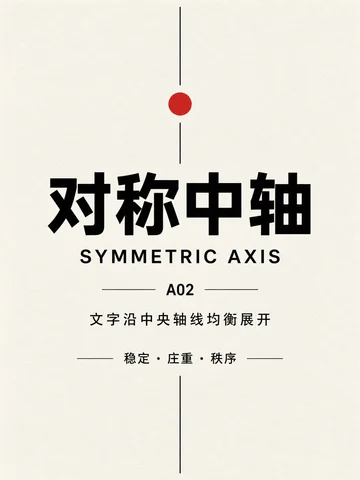

- 原理：文字沿中央轴线均衡展开
- 特征：稳定 / 庄重 / 秩序
- 适合：典礼海报与邀请函；品牌声明与封面
- 避免：不规则且信息量很大的内容；强调速度与冲突的主题
- 同类版式：A01 / A03

### A03 非对称轴线 / ASYMMETRIC AXIS

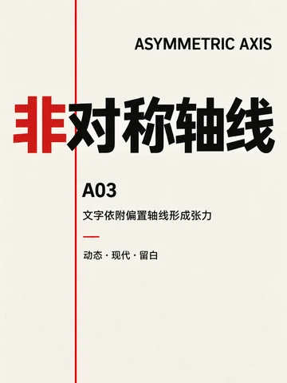

- 原理：文字依附偏置轴线形成张力
- 特征：动态 / 现代 / 留白
- 适合：现代海报与作品集；有明确主次的编辑页面
- 避免：必须严格对称的仪式内容；多组数据的精确对齐
- 同类版式：A02 / A04

### A04 多栏编辑 / MULTI-COLUMN EDITORIAL

- 原理：内容分列并通过栏间关系建立节奏
- 特征：编辑 / 并行 / 秩序
- 适合：杂志长文与研究报告；多主题并行说明
- 避免：只有一句话的标题海报；窄屏上的密集正文
- 同类版式：A03 / A05

### A05 模块信息板 / MODULAR GRID

- 原理：信息被拆分为独立模块
- 特征：分类 / 扫描 / 对照
- 适合：仪表盘与内容索引；分类清晰的信息图
- 避免：需要连续沉浸阅读的文章；只表达单一情绪的封面
- 同类版式：A04 / A06

### A06 主次层级网格 / HIERARCHY GRID

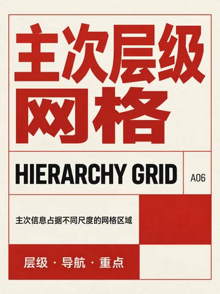

- 原理：主次信息占据不同尺度的网格区域
- 特征：层级 / 导航 / 重点
- 适合：专题首页与课程讲义；主次明确的复杂信息
- 避免：所有项目权重相同的清单；长篇连续叙事
- 同类版式：A05 / A07

### A07 表格参数 / TABULAR DATA

- 原理：文字与数据依靠行列对应关系阅读
- 特征：参数 / 比较 / 精确
- 适合：规格参数与价格比较；数据报告和产品手册
- 避免：情绪化叙事海报；无法形成行列对应的内容
- 同类版式：A06 / A08

### A08 编号目录 / NUMBERED INDEX

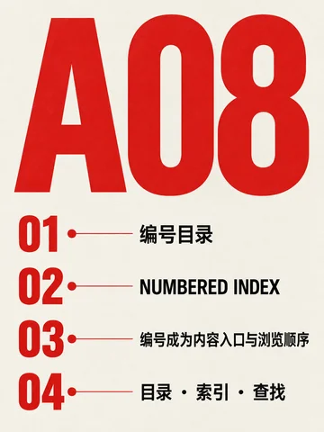

- 原理：编号成为内容入口与浏览顺序
- 特征：目录 / 索引 / 查找
- 适合：目录页与章节导航；步骤或条目索引
- 避免：无先后关系的散文；不希望强调顺序的内容
- 同类版式：A07 / A09

### A09 时间线串联 / TIMELINE FLOW

- 原理：事件沿时间轴按先后顺序展开
- 特征：顺序 / 进程 / 回顾
- 适合：历史事件与项目进度；流程回顾与里程碑
- 避免：非时间关系的概念网络；分支很多的复杂层级
- 同类版式：A08 / A10

### A10 树状层级 / TREE HIERARCHY

- 原理：父级与子级通过分支关系展开
- 特征：层级 / 归属 / 导航
- 适合：组织架构与知识地图；课程章节和分类体系
- 避免：单线连续叙事；层级过深且节点过多的内容
- 同类版式：A09 / A01

## B 整页空间构图

决定文字在整张画布中的分区、围合与重心。

### B01 上下分区 / HORIZONTAL SPLIT

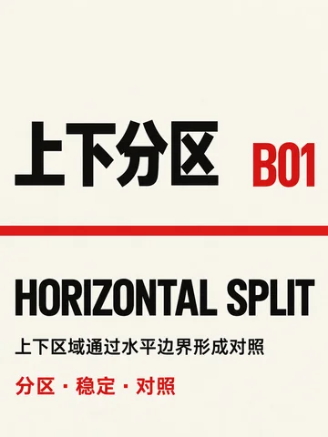

- 原理：上下区域通过水平边界形成对照
- 特征：分区 / 稳定 / 对照
- 适合：上下对照与前后变化；标题区加正文区的海报
- 避免：需要表达多向关系的内容；分区边界不明确的信息
- 同类版式：B10 / B02

### B02 左右分区 / VERTICAL SPLIT

- 原理：左右区域通过垂直边界并置内容
- 特征：并置 / 分工 / 平衡
- 适合：双语并置与方案对比；图文左右分工的页面
- 避免：需要跨页形成单一大焦点；极窄移动端版面
- 同类版式：B01 / B03

### B03 对角分区 / DIAGONAL SPLIT

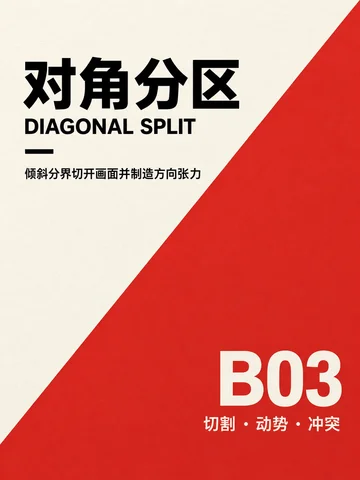

- 原理：倾斜分界切开画面并制造方向张力
- 特征：切割 / 动势 / 冲突
- 适合：运动、音乐与活动海报；强调冲突的主题对照
- 避免：正式公文与长文阅读；要求严谨水平对齐的数据
- 同类版式：B02 / B04

### B04 四角围合 / FOUR-CORNER FRAME

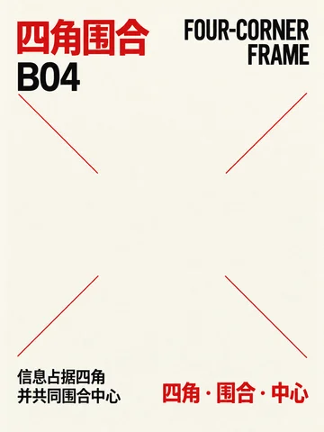

- 原理：信息占据四角并共同围合中心
- 特征：四角 / 围合 / 中心
- 适合：邀请函与中心主题海报；需要保留中央图形的版面
- 避免：中央需要放大量正文；四组信息权重差异很大时
- 同类版式：B03 / B05

### B05 边框围合 / BORDER ENCLOSURE

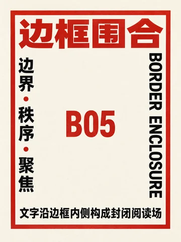

- 原理：文字沿边框内侧构成封闭阅读场
- 特征：边界 / 秩序 / 聚焦
- 适合：证书、封面与公告；需要明确边界的短内容
- 避免：满版摄影或复杂背景；内容需要向画面外延展时
- 同类版式：B04 / B06

### B06 偏置留白 / OFFSET WHITESPACE

- 原理：主体偏置后让连续留白承担停顿
- 特征：偏置 / 呼吸 / 张力
- 适合：艺术展览海报与封面；强调高级留白的短文案
- 避免：等权重的密集信息；说明书和表单类内容
- 同类版式：B05 / B07

### B07 中心聚合 / CENTRAL CLUSTER

- 原理：文字从中心向周围紧密聚拢
- 特征：聚合 / 焦点 / 团块
- 适合：活动主标题与品牌口号；单一核心观点展示
- 避免：长篇顺序阅读；多个彼此独立的信息组
- 同类版式：B06 / B08

### B08 三角聚合 / TRIANGULAR CLUSTER

- 原理：三个方向的文字共同构成三角重心
- 特征：三角 / 稳定 / 指向
- 适合：三部分内容或三项主张；需要稳定重心的视觉页
- 避免：超过三组的平行模块；从上到下的长篇阅读
- 同类版式：B07 / B09

### B09 散点星群 / SCATTERED CONSTELLATION

- 原理：文字点位像星群一样分散但相互关联
- 特征：散点 / 关联 / 节奏
- 适合：关键词网络与概念地图；探索性活动信息
- 避免：严格顺序的操作流程；需要逐项精确比较的数据
- 同类版式：B08 / B10

### B10 嵌套框中框 / NESTED FRAMES

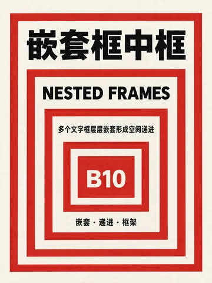

- 原理：多个文字框层层嵌套形成空间递进
- 特征：嵌套 / 递进 / 框架
- 适合：章节套层与主题递进；强调内外关系的封面
- 避免：大量平级项目；小画布中的长段正文
- 同类版式：B09 / B01

## C 标题与尺度组织

用标题尺度、裁切、错位和跨栏建立视觉主次。

### C01 等宽堆叠 / MONOWIDTH STACK

- 原理：等宽文字逐行堆叠成整齐文字块
- 特征：等宽 / 堆叠 / 节奏
- 适合：短口号、片名与栏目名；节奏整齐的封面标题
- 避免：大段正文；每行长度差异极大的文案
- 同类版式：C08 / C02

### C02 大小混排 / SCALE CONTRAST

- 原理：巨型标题与微型说明形成尺度对比
- 特征：对比 / 层级 / 冲击
- 适合：主标题加补充信息；发布封面与宣传海报
- 避免：所有信息同等重要时；需要匀速连续阅读的正文
- 同类版式：C01 / C03

### C03 单字巨型 / GIANT CHARACTER

- 原理：单个汉字放大成为版面主体
- 特征：单字 / 符号 / 聚焦
- 适合：单字主题与节庆海报；需要强符号识别的封面
- 避免：复杂标题和多层信息；字符不能被放大裁切的内容
- 同类版式：C02 / C04

### C04 满版裁切 / FULL-BLEED CROP

- 原理：超大标题越出画框并被边缘裁切
- 特征：满版 / 裁切 / 张力
- 适合：时尚、音乐与展览海报；追求强烈视觉冲击的标题
- 避免：必须完整识读每个字时；保守正式的通知内容
- 同类版式：C03 / C05

### C05 阶梯错位 / STEPPED OFFSET

- 原理：文字逐级错位形成阶梯方向
- 特征：阶梯 / 递进 / 动势
- 适合：步骤感标题与动态封面；需要方向和递进的短句
- 避免：长句或多段正文；必须保持严格水平基线时
- 同类版式：C04 / C06

### C06 跨栏桥接 / CROSS-COLUMN BRIDGE

- 原理：标题跨越多栏连接分散内容
- 特征：跨栏 / 连接 / 统摄
- 适合：杂志跨栏标题与报告开篇；需要统摄多栏内容的主题
- 避免：单栏窄屏页面；标题与各栏无共同主题时
- 同类版式：C05 / C07

### C07 字间嵌套 / INTERLOCKING CHARACTERS

- 原理：字与字相互咬合并共享局部空间
- 特征：嵌套 / 咬合 / 压缩
- 适合：实验标题与文化海报；少量汉字的紧凑组合
- 避免：长文本与小字号信息；识读准确性优先的说明
- 同类版式：C06 / C08

### C08 字腔嵌文 / COUNTERFORM TEXT

- 原理：小字进入大字内部留白形成双层阅读
- 特征：字腔 / 内嵌 / 双层
- 适合：概念海报与字体实验；需要双层阅读的短信息
- 避免：复杂笔画的小字；无足够字腔空间的字体
- 同类版式：C07 / C01

## D 路径与流动

让文字沿直线、曲线、圆环或自由路径形成动势。

### D01 对角字带 / DIAGONAL TYPE BAND

- 原理：文字沿倾斜方向贯穿画面
- 特征：速度 / 动势 / 冲击
- 适合：运动、音乐与促销海报；需要速度感的标题
- 避免：长文阅读；庄重静态的仪式内容
- 同类版式：D10 / D02

### D02 折线路径 / ZIGZAG PATH

- 原理：文字沿折线路径多次转向
- 特征：转折 / 导航 / 节奏
- 适合：路线说明与章节导航；强调转折的叙事
- 避免：连续正文；需要最短阅读路径的信息
- 同类版式：D01 / D03

### D03 弧线标题 / ARCHED HEADING

- 原理：标题沿弧形基线柔和展开
- 特征：弧线 / 柔和 / 引导
- 适合：节庆标题与柔和主题；围绕主体上方的短标题
- 避免：长标题；需要硬朗几何秩序的内容
- 同类版式：D02 / D04

### D04 圆环文字 / CIRCULAR TYPOGRAPHY

- 原理：文字沿圆形基线连续排列
- 特征：循环 / 聚焦 / 闭合
- 适合：徽章、唱片与活动标识；围绕中心图形的短文案
- 避免：长句和精确逐字阅读；中心缺少明确焦点的版面
- 同类版式：D03 / D05

### D05 同心圆层叠 / CONCENTRIC TYPE

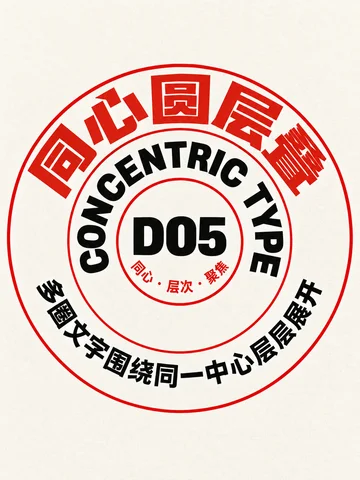

- 原理：多圈文字围绕同一中心层层展开
- 特征：同心 / 层次 / 聚焦
- 适合：层级环状信息与主题辐射；强调同一中心的系列文案
- 避免：线性步骤说明；不同层内容无中心关联时
- 同类版式：D04 / D06

### D06 螺旋文字 / SPIRAL TYPOGRAPHY

- 原理：文字沿螺旋路径由外向内收束
- 特征：螺旋 / 旋入 / 聚焦
- 适合：实验海报与沉浸式主题；由外向内聚焦的短句
- 避免：快速扫描的信息；小字号长文和无障碍优先页面
- 同类版式：D05 / D07

### D07 波浪字带 / WAVE TYPE BAND

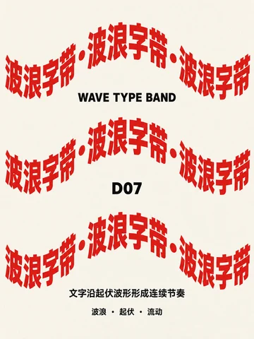

- 原理：文字沿起伏波形形成连续节奏
- 特征：波浪 / 起伏 / 流动
- 适合：音乐、海洋与流动主题；连续但富有韵律的短句
- 避免：表格数据；要求笔直基线的正式文本
- 同类版式：D06 / D08

### D08 放射文字 / RADIAL TYPOGRAPHY

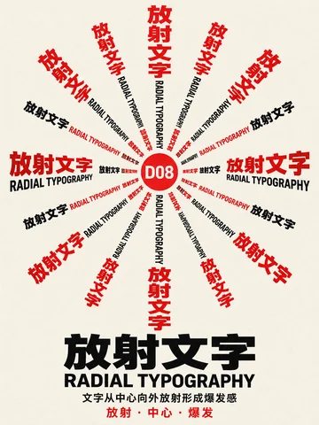

- 原理：文字从中心向外放射形成爆发感
- 特征：放射 / 中心 / 爆发
- 适合：庆典、爆发与中心事件；从核心向外扩散的信息
- 避免：从上到下的顺序阅读；中心区域已经非常拥挤时
- 同类版式：D07 / D09

### D09 自由轮廓路径 / FREEFORM CONTOUR PATH

- 原理：文字沿不规则轮廓路径自由行进
- 特征：轮廓 / 自由 / 路径
- 适合：围绕插图或物体轮廓的文案；艺术与文化活动海报
- 避免：长篇正文；轮廓频繁变化且空间狭窄时
- 同类版式：D08 / D10

### D10 流动层带 / FLOWING TYPE LAYERS

- 原理：多条文字带像流体一样分层穿行
- 特征：层带 / 穿行 / 流动
- 适合：音乐节与动态品牌视觉；多层信息的流动穿插
- 避免：需要逐行精确阅读的内容；信息层级尚未确定时
- 同类版式：D09 / D01

## E 重复与节奏

通过重复、阵列、渐变与突变建立视觉节奏。

### E01 平铺字墙 / TILED TYPE WALL

- 原理：同一文字单元平铺成连续背景
- 特征：平铺 / 重复 / 纹理
- 适合：背景纹理与主题字墙；需要建立强烈重复识别时
- 避免：每个词都必须独立阅读；信息已经非常密集的版面
- 同类版式：E08 / E02

### E02 错列字阵 / STAGGERED TYPE MATRIX

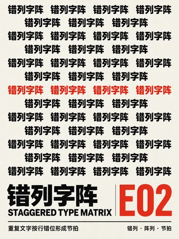

- 原理：重复文字按行错位形成节拍
- 特征：错列 / 阵列 / 节拍
- 适合：音乐、街头与青年文化海报；重复口号的节拍表达
- 避免：严谨表格与正式公文；长句连续阅读
- 同类版式：E01 / E03

### E03 尺度递变阵列 / SCALE PROGRESSION

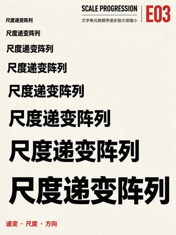

- 原理：文字单元按顺序逐步放大或缩小
- 特征：递变 / 尺度 / 方向
- 适合：表示增长、变化与远近；系列标题的方向引导
- 避免：各项必须同等醒目时；尺度变化会改变信息含义时
- 同类版式：E02 / E04

### E04 疏密渐变 / DENSITY GRADIENT

- 原理：文字从稀疏逐渐过渡到密集
- 特征：疏密 / 渐变 / 聚集
- 适合：表现聚集、扩散与强弱；数据趋势的抽象表达
- 避免：逐项查找的清单；每个单元都必须同样清晰时
- 同类版式：E03 / E05

### E05 重复中的突变 / PATTERN BREAK

- 原理：规则重复中只有一个单元发生突变
- 特征：重复 / 突变 / 强调
- 适合：强调唯一项与异常点；活动焦点或产品差异化
- 避免：没有明确重点的平均信息；多个项目都需要同时突出时
- 同类版式：E04 / E06

### E06 旋转阵列 / ROTATIONAL ARRAY

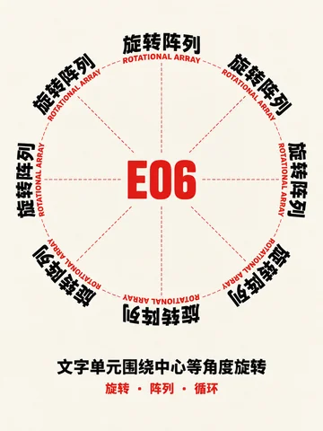

- 原理：文字围绕中心按角度重复旋转
- 特征：旋转 / 阵列 / 中心
- 适合：圆形标志与节庆主题；围绕中心的重复短词
- 避免：长句与段落；中心信息不应被强调时
- 同类版式：E05 / E07

### E07 镜像对读 / MIRROR READING

- 原理：左右文字互为镜像并形成对称阅读
- 特征：镜像 / 对读 / 反射
- 适合：对称主题与正反概念；双语或双观点的形式实验
- 避免：镜像后必须保持可读的长文；左右内容权重不同的页面
- 同类版式：E06 / E08

### E08 回声位移 / ECHO OFFSET

- 原理：同一标题连续位移产生视觉回声
- 特征：位移 / 回声 / 残影
- 适合：声音、速度与记忆主题；标题运动残影
- 避免：小字号正文；必须保持文字边缘清晰时
- 同类版式：E07 / E01

## F 字图关系

处理文字与图形、主体、轮廓和负形之间的关系。

### F01 图文交替叙事 / ALTERNATING TEXT IMAGE

- 原理：文字块与图形块按顺序交替推进
- 特征：交替 / 叙事 / 节奏
- 适合：步骤故事与案例拆解；图文轮流推进的长页
- 避免：只有单张主图的封面；图文没有叙事顺序时
- 同类版式：F08 / F02

### F02 轮廓绕排 / CONTOUR TEXT WRAP

- 原理：文字根据物体边缘逐行缩进
- 特征：贴合 / 避让 / 流动
- 适合：产品轮廓与人物介绍；需要让正文包围主体时
- 避免：没有稳定轮廓的图像；正文很长且栏宽必须统一时
- 同类版式：F01 / F03

### F03 负形嵌文 / NEGATIVE SPACE TEXT

- 原理：文字隐藏在图形之间的负空间中
- 特征：负形 / 发现 / 反转
- 适合：标志化海报与概念封面；用留白形成第二层信息
- 避免：背景复杂且对比不足时；必须直接说明的实用信息
- 同类版式：F02 / F04

### F04 主体穿插标题 / SUBJECT INTERLOCK

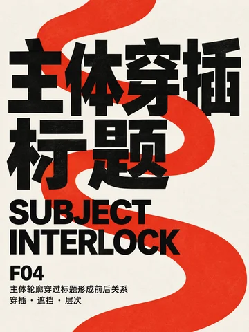

- 原理：主体轮廓穿过标题形成前后关系
- 特征：穿插 / 遮挡 / 层次
- 适合：人物、产品与事件主视觉；标题需要和主体产生纵深时
- 避免：主体边缘不清晰的图片；标题不能被任何部分遮挡时
- 同类版式：F03 / F05

### F05 引线标注 / CALLOUT LABELS

- 原理：文字通过引线指向对应部位
- 特征：标注 / 指向 / 解释
- 适合：产品拆解与知识图解；地图、部件和科学标注
- 避免：情绪化纯视觉海报；标注对象太多且距离太近时
- 同类版式：F04 / F06

### F06 文字图像窗口 / IMAGE WINDOW TYPE

- 原理：大字内部成为承载图像的窗口
- 特征：字窗 / 裁切 / 融合
- 适合：字形蒙版与主题封面；通过文字展示局部图像
- 避免：图片关键内容无法落入字形时；小字号和正文
- 同类版式：F05 / F07

### F07 文字拼成图像 / TYPOGRAPHIC IMAGE

- 原理：大量文字单元共同拼成可识别图像
- 特征：字像 / 聚合 / 识别
- 适合：肖像文字画与主题纪念图；大量词汇汇聚成单一形象
- 避免：低对比或细节复杂的主体；需要快速阅读所有词语时
- 同类版式：F06 / F08

### F08 图文棋盘 / TEXT IMAGE CHECKERBOARD

- 原理：文字与图形按棋盘格交替排列
- 特征：棋盘 / 交替 / 模块
- 适合：作品集索引与多项目展示；图文等权重的模块组合
- 避免：单一连续故事；模块尺寸差异非常大时
- 同类版式：F07 / F01

## G 中文与多语编排

处理中文竖排、传统格式以及中外文并置。

### G01 传统竖排 / TRADITIONAL VERTICAL

- 原理：汉字自上而下成列并从右向左阅读
- 特征：竖排 / 传统 / 节奏
- 适合：诗词、传统文化与书籍装帧；强调东方阅读方向的短文
- 避免：横向表格和拉丁文长句；用户不熟悉竖排阅读时
- 同类版式：G08 / G02

### G02 横竖双轴 / DUAL-AXIS LAYOUT

- 原理：横排与竖排文字在同一画面交汇
- 特征：双轴 / 交汇 / 中西
- 适合：中英混排与文化海报；需要同时表现两种阅读方向
- 避免：长篇连续正文；信息层级尚不清晰时
- 同类版式：G01 / G03

### G03 对联横批 / COUPLET AND HEADER

- 原理：两列竖向文字与顶部横题共同构图
- 特征：对联 / 横批 / 仪式
- 适合：节庆、门联与传统活动；成对口号加总标题
- 避免：左右内容无法成对时；现代数据密集页面
- 同类版式：G02 / G04

### G04 题签落款 / TITLE SLIP AND SIGNATURE

- 原理：竖向题签与角落落款建立传统书卷秩序
- 特征：题签 / 落款 / 书卷
- 适合：书籍封面、展签与文化品牌；少量文字的署名式编排
- 避免：多级复杂信息；要求大字号高冲击的促销内容
- 同类版式：G03 / G05

### G05 古籍夹注 / CLASSICAL SIDE NOTES

- 原理：正文旁附加小号夹注形成双层解释
- 特征：正文 / 夹注 / 考据
- 适合：古籍复刻与学术注释；正文旁需要补充解释时
- 避免：移动端快速浏览；注释与正文无法清楚对应时
- 同类版式：G04 / G06

### G06 诗词错落 / POETIC STAGGER

- 原理：诗句通过不等行距和错落位置形成韵律
- 特征：诗意 / 错落 / 停顿
- 适合：诗歌、散文与情绪化短句；需要停顿和留白的文化海报
- 避免：表格与操作说明；必须严格按行连续阅读时
- 同类版式：G05 / G07

### G07 汉字方阵 / HANZI MATRIX

- 原理：汉字按正方矩阵紧密排列
- 特征：方阵 / 汉字 / 秩序
- 适合：汉字主题展览与字符索引；等权重字词的方形阵列
- 避免：长句和语法连续的正文；字符数量无法适配网格时
- 同类版式：G06 / G08

### G08 双语对照 / BILINGUAL PARALLEL

- 原理：两种语言按对应关系并列阅读
- 特征：双语 / 对照 / 对应
- 适合：双语手册与国际活动；原文译文逐段对应
- 避免：两种语言篇幅差异过大时；只追求单一主视觉的封面
- 同类版式：G07 / G01

## H 实验与空间编排

探索拼贴、解构、多轴、透视和空间错视。

### H01 文字拼贴 / TYPOGRAPHIC COLLAGE

- 原理：不同字体与文字碎片像纸片一样拼贴
- 特征：拼贴 / 异质 / 编辑
- 适合：文化、音乐与实验杂志；多来源短句的情绪拼合
- 避免：正式报告与说明书；需要清晰单一路径的内容
- 同类版式：H10 / H02

### H02 切片错位 / SLICED DISPLACEMENT

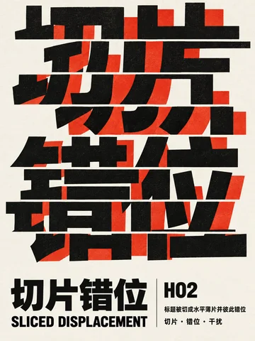

- 原理：标题被切成水平薄片并彼此错位
- 特征：切片 / 错位 / 干扰
- 适合：科技、故障与数字主题；短标题的断裂动势
- 避免：正文与小字号；品牌名称必须完整无变形时
- 同类版式：H01 / H03

### H03 解构重组 / DECONSTRUCTED TYPE

- 原理：完整字形被拆解后重新组合
- 特征：解构 / 重组 / 实验
- 适合：先锋展览与概念海报；熟悉文字的再组合表达
- 避免：首次出现的专有名词；信息传达效率优先的页面
- 同类版式：H02 / H04

### H04 多轴交错 / MULTI-AXIS CROSS

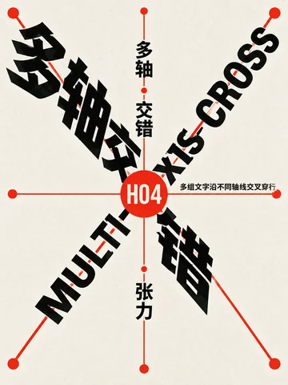

- 原理：多组文字沿不同轴线交叉穿行
- 特征：多轴 / 交错 / 张力
- 适合：复杂议题与多声部内容；多方向标题的实验页面
- 避免：单线叙事；方向变化会妨碍基本识读时
- 同类版式：H03 / H05

### H05 图底反转 / FIGURE-GROUND REVERSAL

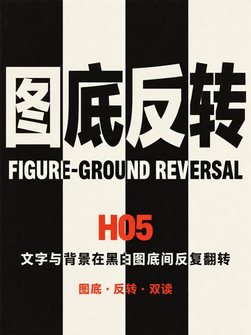

- 原理：文字与背景在黑白图底间反复翻转
- 特征：图底 / 反转 / 双读
- 适合：正负空间主题与概念标识；需要制造双重视觉焦点时
- 避免：背景层次过多时；对比度必须始终稳定的长文
- 同类版式：H04 / H06

### H06 透视字廊 / PERSPECTIVE TYPE CORRIDOR

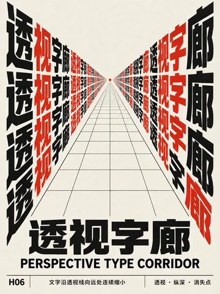

- 原理：文字沿透视线向远处连续缩小
- 特征：透视 / 纵深 / 消失点
- 适合：展览入口与未来感海报；需要纵深和引导感的标题
- 避免：数据表和正文；透视会导致关键文字变形时
- 同类版式：H05 / H07

### H07 曲面包裹 / SURFACE-WRAPPED TYPE

- 原理：文字贴合圆柱曲面发生连续弯曲
- 特征：曲面 / 包裹 / 空间
- 适合：包装概念与三维主题；文字贴合球体或曲面时
- 避免：必须保持字形比例的标志；长篇阅读
- 同类版式：H06 / H08

### H08 折面跨越 / FOLDED PLANE TYPE

- 原理：文字跨越折叠平面并随折线改变方向
- 特征：折面 / 跨越 / 转向
- 适合：建筑、折纸与空间主题；跨越多个平面的短标题
- 避免：正文与小字；折面遮挡会改变关键信息时
- 同类版式：H07 / H09

### H09 景深叠层 / DEPTH LAYERING

- 原理：多层文字以大小清晰度建立前后景深
- 特征：景深 / 叠层 / 空间
- 适合：电影、舞台与空间海报；通过前中后景建立层级
- 避免：所有信息必须同等清晰时；需要稳定字号和清晰度的正文
- 同类版式：H08 / H10

### H10 错视重构 / OPTICAL RECONSTRUCTION

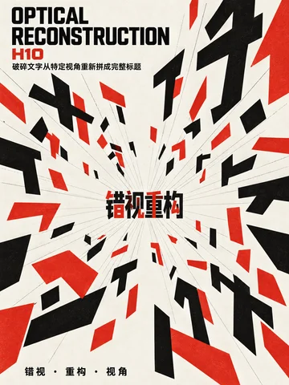

- 原理：破碎文字从特定视角重新拼成完整标题
- 特征：错视 / 重构 / 视角
- 适合：艺术展与视觉谜题；熟悉词语的错视重构
- 避免：安全提示和操作说明；需要瞬间无歧义识读的内容
- 同类版式：H09 / H01
